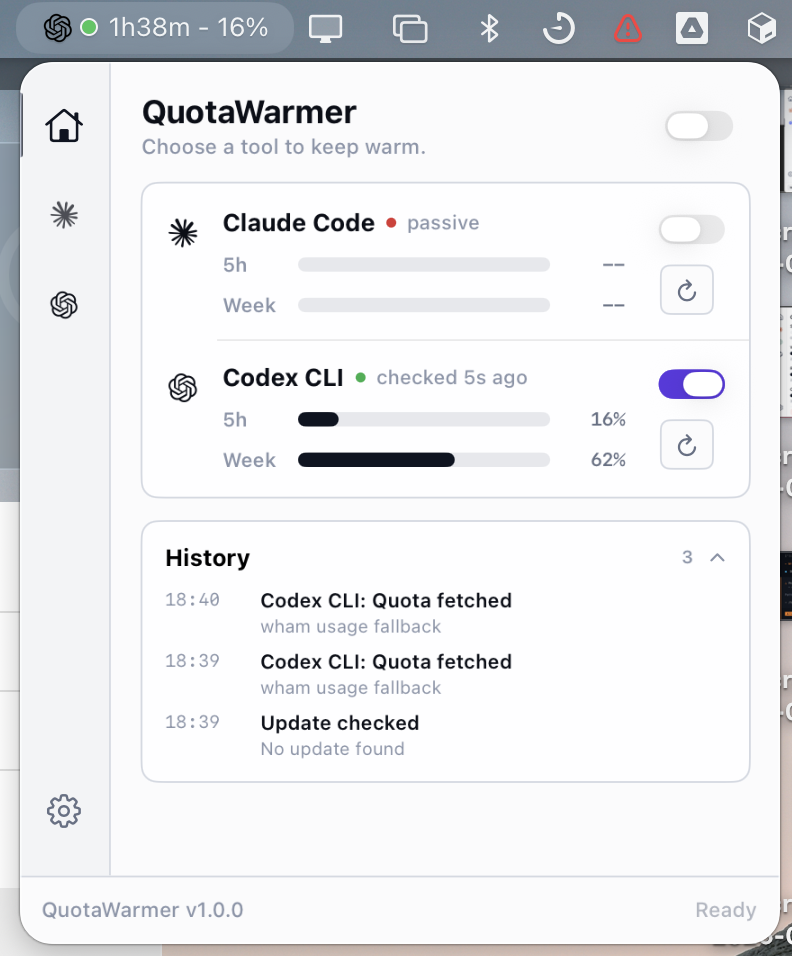

# QuotaWarmer

QuotaWarmer is a compact macOS menu bar app for keeping Claude Code and Codex CLI quota windows ready when you need them.

It watches live quota snapshots, shows the active provider directly in the menu bar, and can send a minimal warm-up command when a fresh 5-hour window becomes available.



## Highlights

- **Menu bar status at a glance**: provider glyph, active-state dot, 5-hour countdown, and remaining quota percentage.
- **Claude Code and Codex CLI support**: each provider can be enabled, refreshed, and warmed independently.
- **Live quota tracking**: reset decisions use fresh server quota snapshots; local logs are used only as display context.
- **Automatic warm-up**: sends a minimal `hi` command after a safe reset signal, using low-cost settings.
- **Manual controls**: refresh quota or warm a provider directly from the popover.
- **Lightweight history**: recent quota checks, warm-ups, update checks, and failures are visible without leaving the menu.
- **Notifications and update checks**: optional quota-window reminders plus in-app release availability.
- **Launch at login**: runs quietly as a menu bar utility.

## How It Works

Claude Code and Codex CLI use rolling quota windows. If a window starts only when you remember to open the CLI, part of the available time can be wasted.

QuotaWarmer keeps the app running in the menu bar and periodically checks quota state for active providers. When a fresh reset is detected, it runs a minimal warm-up command from an isolated temporary working directory:

```bash
claude --model haiku --effort low --no-session-persistence -p 'hi'
codex exec --model 5.4-mini -c model_reasoning_effort="low" --skip-git-repo-check --ephemeral --ignore-rules 'hi'
```

If `5.4-mini` is unavailable for the signed-in Codex account, QuotaWarmer retries once with the configured default Codex model and low reasoning effort.

Local activity is scanned from:

```text
~/.claude/projects/*/*.jsonl
~/.codex/sessions/YYYY/MM/DD/*.jsonl
```

These logs help the UI show context, but stale local activity does not trigger automatic warm-ups.

## Requirements

| Dependency | Requirement |
| --- | --- |
| macOS | 14.0 Sonoma or later |
| Xcode | 16+ for local builds |
| Claude Code | Installed and available on your shell `PATH` |
| Codex CLI | Installed and available on your shell `PATH` |

QuotaWarmer shows setup guidance on first launch if a required CLI is missing.

## Install

1. Download the latest `QuotaWarmer-<version>-universal.dmg` from [Releases](https://github.com/bcanozgur/quota-warmer/releases).
2. Open the DMG.
3. Drag **QuotaWarmer.app** to **Applications**.
4. Launch **QuotaWarmer** from Applications.

Release builds are signed and notarized. For local unsigned builds, you may need to clear quarantine once:

```bash
xattr -cr /Applications/QuotaWarmer.app
```

## Build From Source

Install XcodeGen, generate the project, and open it in Xcode:

```bash
brew install xcodegen
git clone https://github.com/bcanozgur/quota-warmer.git
cd quota-warmer
xcodegen generate
open QuotaWarmer.xcodeproj
```

CLI build:

```bash
xcodebuild -project QuotaWarmer.xcodeproj -scheme QuotaWarmer build
```

Build a local Release app, replace any existing `/Applications/QuotaWarmer.app`, clear quarantine, and launch it:

```bash
scripts/local-package.command
```

## Project Structure

```text
Sources/QuotaWarmer/
  Models/       Shared app and quota types
  Services/     Quota checks, scheduling, notifications, updates, warm-up commands
  Views/        SwiftUI menu bar label, popover, provider, and settings screens
  Assets.xcassets/
project.yml     XcodeGen project definition
scripts/        Local install and packaging helpers
```

## Release Process

Releases are built by GitHub Actions from `vMAJOR.MINOR.PATCH` tags. The release workflow validates the tag against `project.yml`, builds the macOS app, signs and notarizes the DMG, uploads `latest.json`, and verifies release assets.

Required repository secrets:

| Secret | Purpose |
| --- | --- |
| `APPLE_CERTIFICATE` | Base64-encoded Developer ID Application `.p12` |
| `APPLE_CERTIFICATE_PASSWORD` | Password for the `.p12` |
| `APPLE_SIGNING_IDENTITY` | Developer ID Application signing identity |
| `APPLE_ID` | Apple ID used for notarization |
| `APPLE_PASSWORD` | App-specific password for notarization |
| `APPLE_TEAM_ID` | Apple Developer Team ID |
| `KEYCHAIN_PASSWORD` | Temporary CI keychain password |

## License

MIT
