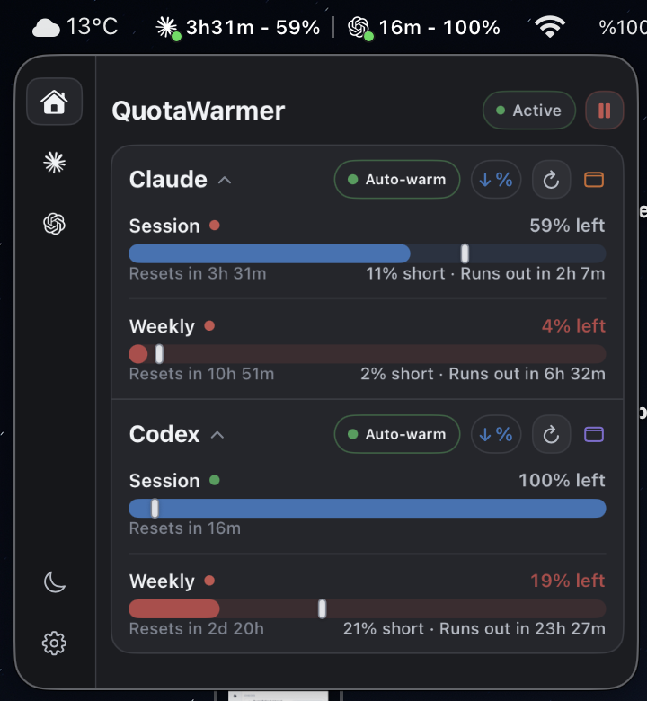

# QuotaWarmer

QuotaWarmer is a compact macOS menu bar app that manages your Claude Code and Codex CLI capacity — it keeps your own rolling quota windows in view and, when you ask it to, ready to use the moment they reset.

By default it only **monitors**: it watches live quota snapshots and shows each provider's window directly in the menu bar. Switch a tool to **Auto-warm** and it will also send a single minimal warm-up command through your own logged-in CLI the instant a fresh 5-hour window opens — then verify the window actually started.

<p align="center">
  
</p>

## Highlights

### Quota at a glance

- **Menu bar status**: each pinned provider shows its glyph, a mode/health dot, the 5-hour countdown and its quota percentage — Claude and Codex side by side, each pinnable independently.
- **Session and weekly windows**: both windows per provider, with reset countdowns.
- **Pace bars**: a knob on every bar marks how much of the window's *time* is left. When quota runs faster than time, the row says how far behind you are and when the quota will run out (`13% short · Runs out in 2h 0m`).
- **Left or used**: a per-provider **↓% / ↑%** toggle switches between quota *left* (bar drains from 100%) and quota *used* (bar fills from 0%, like claude.ai's Usage page). The menu bar percentage follows the same choice.
- **Colorful quota bars**: bars turn **blue → orange at 50% used → red at 80% used**, in Claude-style colors. Prefer the classic look? Turn off *Colorful Quota Bars* in Settings for single-color bars.
- **Light, dark or system theme**: a sidebar button cycles **System ◐ → Light ☀︎ → Dark ☾**. System follows macOS, including live switches.
- **Estimated API-equivalent cost**: today, yesterday and the last 30 days per provider, from local CLI logs. The price catalog updates itself daily from this repo, and unknown models are shown as unpriced instead of `$0.00`.

### Warm-ups

- **Three modes per tool**: **Off**, **Monitor** (watch quota, never send anything — the default), or **Auto-warm** (claim fresh windows automatically). A global pause stops every automatic warm-up at once.
- **Window claim receipt**: after a warm-up, QuotaWarmer re-checks quota to confirm the window actually opened — so "sent" never quietly means "missed."
- **Morning pre-warm**: optionally wakes a sleeping Mac at a time you type in (weekdays only if you like) so a fresh window is already running when you sit down.
- **Low-cost, isolated warm-ups**: a pinned cheap model, one turn, no tools, no session saved, run from an empty temp directory.

### Reliability

- **Live quota tracking**: reset decisions use fresh server quota snapshots; local logs are display context only.
- **Rate-limit guard**: failed checks and warm-ups back off exponentially instead of hammering the provider.
- **Quiet credentials**: background checks never raise a Keychain password dialog. After `claude auth login`, the app re-checks automatically within seconds.
- **Liveness watchdog**: if the app ever stops checking quota, the menu bar and popover say so instead of looking healthy.

### Everyday use

- **Manual controls**: refresh quota or warm a provider directly from the popover; collapse either provider card.
- **Right-click menu**: jump to stats or settings, set the diagnostics level, or quit.
- **History, notifications and updates**: recent checks, warm-ups and failures in Settings; optional reminders before a window resets and when a window is claimed; in-app update checks.
- **Launch at login**: runs quietly as a menu bar utility.

## Is this allowed?

QuotaWarmer uses capacity you already pay for, through the official CLI you're already signed into. It never bypasses or raises your limits, never shares or uploads your credentials, and sends nothing at all for tools left on Monitor or Off. Providers may change their APIs at any time; if automated warm-up is ever disallowed, set a tool to Monitor and QuotaWarmer keeps tracking your quota.

## How It Works

Claude Code and Codex CLI use rolling quota windows. If a window starts only when you remember to open the CLI, part of the available time can be wasted.

QuotaWarmer keeps the app running in the menu bar and periodically checks quota state for monitored providers. For a tool set to Auto-warm, when a fresh reset is detected it runs a minimal warm-up command from an isolated temporary working directory:

```bash
claude --model haiku --effort low --settings '{"alwaysThinkingEnabled":false}' --safe-mode --strict-mcp-config --system-prompt 'Reply with one word.' --no-session-persistence --max-turns 1 --tools '' -p 'hi'
codex exec --model gpt-5.6-luna -c model_reasoning_effort="low" --skip-git-repo-check --ephemeral --ignore-user-config --ignore-rules 'hi'
```

Both commands pin a bounded low-cost model and do not fall back to the user's default model. The Claude run skips your `CLAUDE.md`, MCP servers, skills and thinking, so a warm-up costs roughly 400 tokens. Codex ignores user configuration for this isolated run while continuing to use the existing Codex authentication. The warm-up model lists live in `Sources/QuotaWarmer/Resources/*-models.json`; if a CLI rejects a model, the next one in the list is tried.

**Morning pre-warm** uses a daily `pmset repeat wakeorpoweron` schedule, so changing it asks for your administrator password once. Waking is best-effort on battery with the lid closed.

Local activity is scanned from:

```text
~/.claude/projects/*/*.jsonl
~/.codex/sessions/YYYY/MM/DD/*.jsonl
```

These logs help the UI show context, but stale local activity does not trigger automatic warm-ups.

Token costs shown in the popover are estimates using public API-equivalent rates, not actual Claude or ChatGPT subscription charges. A period containing an unknown or unpriced model is marked unavailable instead of being reported as `$0.00`.

## Requirements

| Dependency | Requirement |
| --- | --- |
| macOS | 14.0 Sonoma or later |
| Xcode | 16+ for local builds |
| Claude Code | Installed and available on your shell `PATH` |
| Codex CLI | Installed and available on your shell `PATH` |

QuotaWarmer shows setup guidance on first launch if a required CLI is missing.

## Install

### Homebrew (recommended)

```bash
brew install --cask bcanozgur/tap/quotawarmer
```

Update later with `brew upgrade --cask quotawarmer`.

### Manual download

1. Download the latest `QuotaWarmer-<version>-universal.dmg` from [Releases](https://github.com/bcanozgur/quota-warmer/releases).
2. Open the DMG and drag **QuotaWarmer.app** to **Applications**.
3. Launch **QuotaWarmer** from Applications.

### First launch (Gatekeeper)

QuotaWarmer is ad-hoc signed but **not Apple-notarized**, so macOS quarantines it on
download. Clear the quarantine once after installing:

```bash
xattr -dr com.apple.quarantine "/Applications/QuotaWarmer.app"
```

…or right-click **QuotaWarmer.app** in Applications and choose **Open** the first time.

## Build From Source

Install XcodeGen, generate the project, and open it in Xcode:

```bash
brew install xcodegen
git clone https://github.com/bcanozgur/quota-warmer.git
cd quota-warmer
xcodegen generate
open QuotaWarmer.xcodeproj
```

CLI build:

```bash
xcodebuild -project QuotaWarmer.xcodeproj -scheme QuotaWarmer build
```

Build a local Release app, replace any existing `/Applications/QuotaWarmer.app`, clear quarantine, and launch it:

```bash
scripts/local-package.command
```

Run the regression suites (standalone `swiftc` builds — the same ones CI runs; see `.github/workflows/ci.yml` for the exact file lists):

- `scripts/quota-extractor-regression.swift` — quota parsing, warm-up commands, cost estimates
- `scripts/quota-display-regression.swift` — left/used display, bar colors, menu-bar text, theme cycle, wake-time input

## Project Structure

```text
Sources/QuotaWarmer/
  Models/       Shared app and quota types
  Services/     Quota checks, scheduling, notifications, updates, warm-up commands
  Views/        SwiftUI menu bar label, popover, provider, and settings screens
  Assets.xcassets/
project.yml     XcodeGen project definition
scripts/        Packaging helpers, regression suites, model-catalog checker
```

## Release Process

Releases are built by GitHub Actions from `vMAJOR.MINOR.PATCH` tags. The release workflow validates the tag against `project.yml`, builds the macOS app, signs and notarizes the DMG, uploads `latest.json`, and verifies release assets.

Required repository secrets:

| Secret | Purpose |
| --- | --- |
| `APPLE_CERTIFICATE` | Base64-encoded Developer ID Application `.p12` |
| `APPLE_CERTIFICATE_PASSWORD` | Password for the `.p12` |
| `APPLE_SIGNING_IDENTITY` | Developer ID Application signing identity |
| `APPLE_ID` | Apple ID used for notarization |
| `APPLE_PASSWORD` | App-specific password for notarization |
| `APPLE_TEAM_ID` | Apple Developer Team ID |
| `KEYCHAIN_PASSWORD` | Temporary CI keychain password |

## License

MIT
